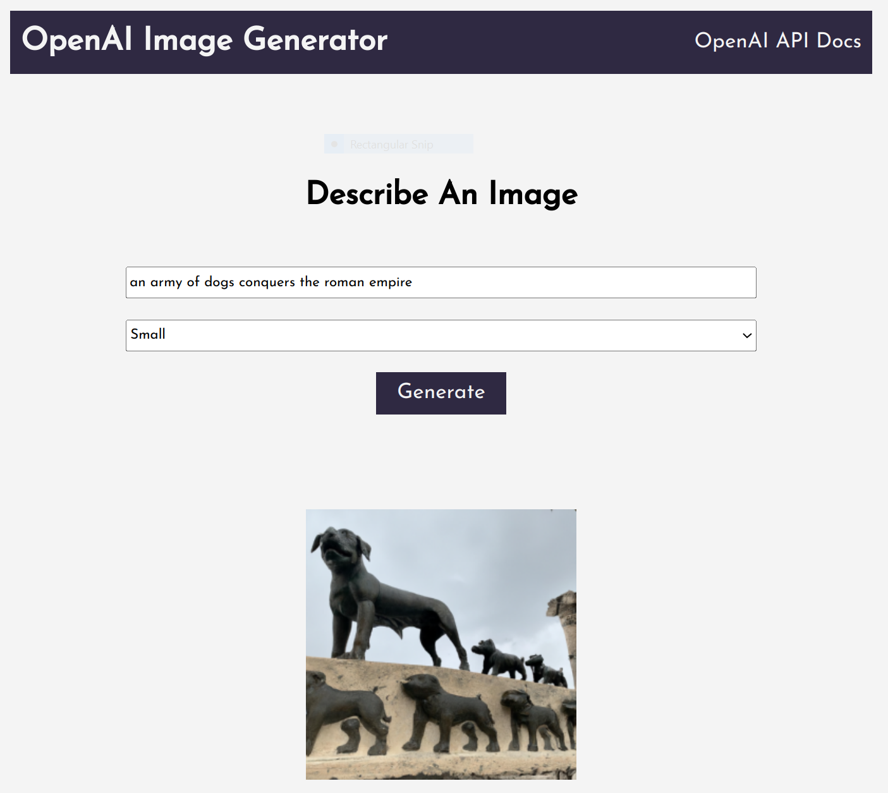

# OpenAI Image Generator

A simple image that uses the OpenAI Dall-E Image API to generate images.

## Built with

- OpenAI Dall-E Image API
- Node.js
- Express

## How to build

Rename the `example.env` file to `.env`.

Generate an API KEY at [OpenAI](https://beta.openai.com/) and add it to the `.env` file.

Clone the repo

```bash
git clone https://github.com/erynder-z/ai-image-generator.git
```

Install the dependencies

```bash
npm install
```

Run server

```bash
npm start
```

Visit `http://localhost:5000` in your browser.


